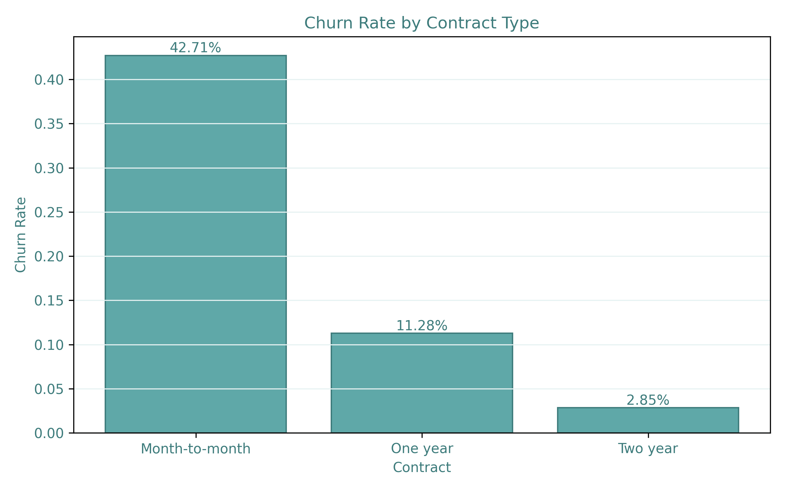
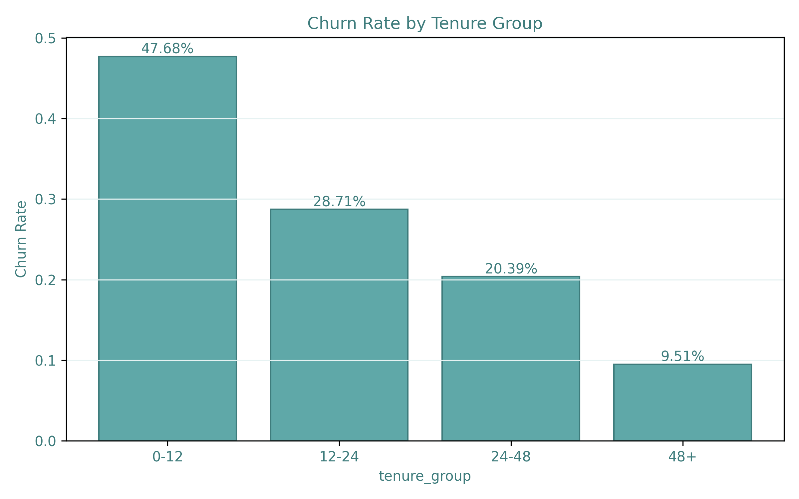
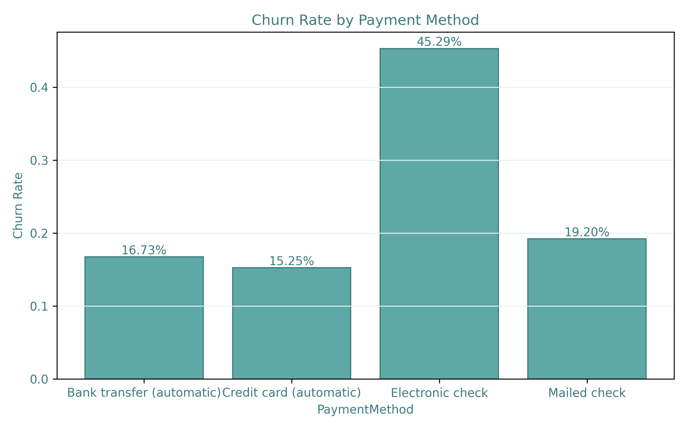
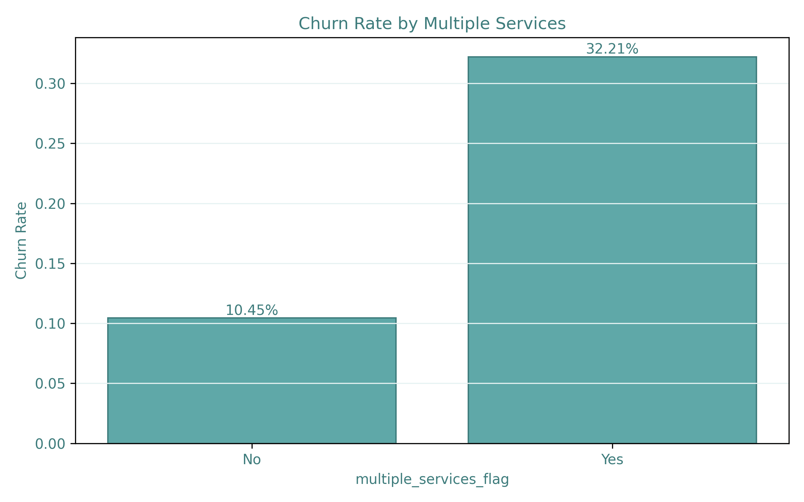
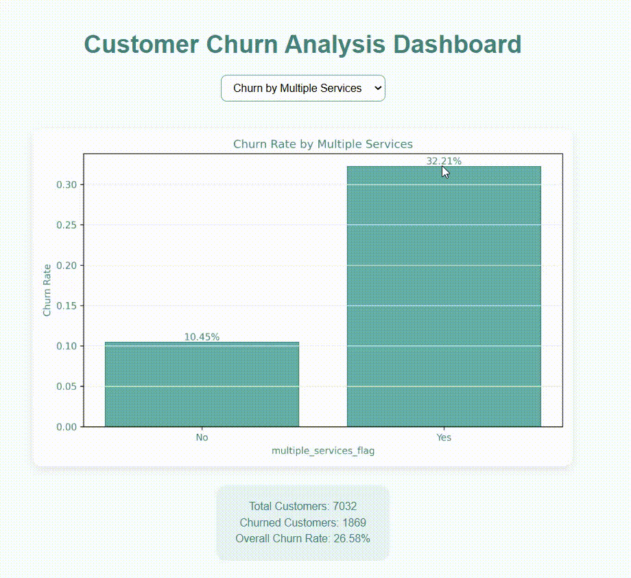

# 📊 pandas-customer-churn-analysis

A **customer churn analysis project using Pandas**, focused on understanding customer behavior, feature engineering, and segment-based churn patterns in subscription-based services.

The project follows a **layered data pipeline architecture**, separating data cleaning, feature engineering, analytical aggregation, and visual reporting.

The main objective is to identify **who churns, under which conditions, and which customer segments are most at risk**, using interpretable statistical analysis rather than predictive modeling.

---

## 📌 Project Overview

Customer churn is one of the most critical challenges for subscription-based businesses, as acquiring new customers is often more expensive than retaining existing ones.

This project aims to:

- Quantify overall churn behavior
- Identify high-risk customer segments
- Analyze how contract type, tenure, services, and payment methods relate to churn
- Produce clean analytical outputs

The project provides:

- A structured data pipeline (`raw → cleaned → featured → aggregated`)
- Domain-driven feature engineering
- Segment-level churn analysis
- Static PNG visualizations and an interactive HTML dashboard

---

## 📊 Dataset

[**Telco Customer Churn Dataset (Kaggle)**](https://www.kaggle.com/datasets/blastchar/telco-customer-churn)

The dataset contains customer-level records for a telecom company.

### Key Attributes

- Customer demographics (gender, senior citizen, dependents)
- Account information (tenure, contract type, payment method)
- Service usage (internet service, streaming, security, tech support)
- Financial metrics (monthly charges, total charges)
- Target variable: **Churn (Yes / No)**

### Data Organization

- Raw data: `data/raw`
- Cleaned data: `data/cleaned`
- Feature-engineered data: `data/featured`

---

### 🧩 Churn by Customer Segments

#### 📄 Churn by Contract Type
- Comparison of churn rates across different contract durations  


---

#### ⏳ Churn by Tenure Group
- Analysis of how customer lifetime affects churn probability  


---

#### 💳 Churn by Payment Method
- Identifying payment methods associated with higher churn risk  


---

#### 📡 Churn by Multiple Services Subscription
- Impact of having multiple subscribed services on churn behavior  


---

### 🌐 Interactive Dashboard Preview

- All segment-based churn analyses are available in an interactive dashboard  
  with dropdown selection and dynamic KPI updates.


🖱️ **Live Dashboard:**  
<a href="https://busracevik.github.io/pandas-customer-churn-analysis/index.html" target="_blank">View Interactive Churn Dashboard</a>

---

## 📁 Project Structure

```text

pandas-customer-churn-analysis/
│
├── data/
│   ├── raw/                # Original customer dataset
│   ├── cleaned/            # Cleaned and preprocessed data
│   └── featured/           # Feature-engineered dataset
│
├── outputs/
│   ├── csv/                # Churn metrics by different segments
│   └── figures/            # Static churn visualizations 
│
├── src/
│   ├── data_preparation.py
│   ├── dashboard.py
│   ├── feature_engineering.py
│   ├── churn_analysis.py
│   └── visualization.py
│
├── docs/
│   ├── demo.gif
│   └── index.html          # Interactive dashboard
│
├── main.py                 # End-to-end pipeline execution
├── requirements.txt
└── README.md

```

---

## 🛠 Technologies Used

- **Python** – Core programming language  
- **Pandas** – Data cleaning, feature engineering, and aggregation  
- **NumPy** – Numerical operations and ratio calculations  
- **Matplotlib** – Static churn visualizations (PNG)  
- **HTML / JavaScript** – Interactive dashboard with dynamic chart selection  
- **GitHub Pages** – Hosting the live dashboard  

---

## 🧠 Analytical Approach

This project focuses on **business-driven churn analysis** rather than predictive modeling.  
No machine learning models are applied.

The analysis is based on:

- Customer segmentation  
- Behavioral feature engineering  
- Group-based statistical aggregation  
- Comparative churn rate evaluation across segments  

The goal is to answer **why customers churn** and **which groups are at higher risk**,  
not to predict individual churn probabilities.

